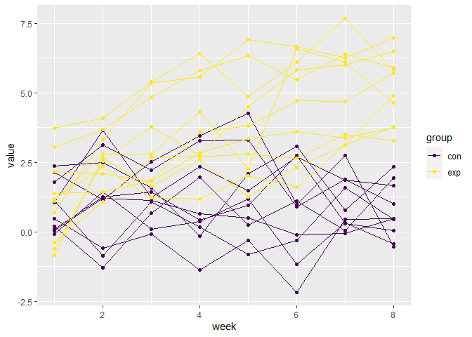

p8105_hw5_hz2771
================
Haolin Zhong (UNI: hz2771)
2021/11/18

## Dependencies

``` r
library(tidyverse)
library(purrr)
```

## Problem 2

### Create dataframe

``` r
lgtd = tibble(
  filenames = list.files("./data/")
)
```

### Read in data iteratvely

``` r
lgtd = 
  lgtd %>% 
  mutate(
    filepaths = str_c("./data/", filenames)    
  ) %>% 
  mutate(
    data = map(filepaths, read_csv)
  )
```

### Tidy the result

``` r
lgtd_tidy = 
  lgtd %>% 
  mutate(
    filenames = str_replace(filenames, ".csv", ""),
    group = str_sub(filenames, 1, 3)
  ) %>% 
  unnest() %>% 
  pivot_longer(names_to = "week", 
               values_to = "value", 
               cols = "week_1":"week_8") %>% 
  mutate(
    week = str_replace(week, "week_", ""),
    week = as.numeric(week)
  ) %>% 
  select(subject = filenames, group, week, value)
```

### Make the spaghetti plot

``` r
lgtd_tidy %>% 
  ggplot(aes(x = week, y = value, group = subject, color = group)) +
  geom_path() +
  geom_point() +
  scale_color_viridis_d()
```

<!-- -->

Through the plot, we can observe two obvious trends:

-   In experiment group, values of subjects increased over time in an
    approximate linear style, while in control group values of subjects
    basically stay stable.

-   In both groups, within the group, subjects with relatively high
    initial value end with relatively high value, and subjects with
    relatively low initial value end with relatively low value.

## Problem 3

### Load data

``` r
set.seed(10)

iris_with_missing = iris %>% 
  map_df(~replace(.x, sample(1:150, 20), NA)) %>%
  mutate(Species = as.character(Species))
```

### Write function

``` r
fill_na = function(vec) {
  
  vec_class = class(vec)
  
  if (vec_class == "character") {
    vec = replace_na(vec, "virginica")
  }else if (vec_class == "numeric") {
    avg = round(mean(vec, na.rm = TRUE), 2)
    vec = replace_na(vec, avg)
  }else{
    print("wrong input data type!")
  }
  
  return(vec)
}
```

### Apply function

``` r
iris_filled = iris_with_missing %>% map(fill_na) %>% as_tibble()

iris_filled %>% knitr::kable()
```

| Sepal.Length | Sepal.Width | Petal.Length | Petal.Width | Species    |
|-------------:|------------:|-------------:|------------:|:-----------|
|         5.10 |        3.50 |         1.40 |        0.20 | setosa     |
|         4.90 |        3.00 |         1.40 |        0.20 | setosa     |
|         4.70 |        3.20 |         1.30 |        0.20 | setosa     |
|         4.60 |        3.10 |         1.50 |        1.19 | setosa     |
|         5.00 |        3.60 |         1.40 |        0.20 | setosa     |
|         5.40 |        3.90 |         1.70 |        0.40 | setosa     |
|         5.82 |        3.40 |         1.40 |        0.30 | setosa     |
|         5.00 |        3.40 |         1.50 |        0.20 | setosa     |
|         4.40 |        2.90 |         1.40 |        0.20 | setosa     |
|         4.90 |        3.10 |         3.77 |        0.10 | setosa     |
|         5.40 |        3.08 |         1.50 |        0.20 | setosa     |
|         4.80 |        3.40 |         1.60 |        0.20 | setosa     |
|         5.82 |        3.08 |         1.40 |        0.10 | setosa     |
|         4.30 |        3.00 |         3.77 |        0.10 | setosa     |
|         5.82 |        4.00 |         3.77 |        0.20 | setosa     |
|         5.70 |        4.40 |         1.50 |        0.40 | setosa     |
|         5.40 |        3.90 |         1.30 |        0.40 | setosa     |
|         5.10 |        3.50 |         1.40 |        1.19 | setosa     |
|         5.70 |        3.80 |         1.70 |        0.30 | setosa     |
|         5.10 |        3.80 |         1.50 |        1.19 | setosa     |
|         5.40 |        3.40 |         1.70 |        0.20 | setosa     |
|         5.10 |        3.70 |         1.50 |        0.40 | virginica  |
|         4.60 |        3.60 |         1.00 |        0.20 | setosa     |
|         5.82 |        3.30 |         3.77 |        0.50 | setosa     |
|         4.80 |        3.40 |         1.90 |        0.20 | virginica  |
|         5.00 |        3.00 |         3.77 |        0.20 | setosa     |
|         5.00 |        3.40 |         1.60 |        0.40 | virginica  |
|         5.20 |        3.50 |         1.50 |        0.20 | setosa     |
|         5.82 |        3.40 |         1.40 |        0.20 | setosa     |
|         4.70 |        3.20 |         1.60 |        0.20 | setosa     |
|         4.80 |        3.10 |         3.77 |        0.20 | setosa     |
|         5.40 |        3.08 |         1.50 |        0.40 | setosa     |
|         5.20 |        3.08 |         1.50 |        0.10 | setosa     |
|         5.50 |        4.20 |         1.40 |        0.20 | setosa     |
|         4.90 |        3.10 |         3.77 |        0.20 | setosa     |
|         5.00 |        3.20 |         1.20 |        0.20 | setosa     |
|         5.50 |        3.50 |         1.30 |        0.20 | setosa     |
|         4.90 |        3.60 |         1.40 |        0.10 | setosa     |
|         4.40 |        3.00 |         1.30 |        1.19 | setosa     |
|         5.10 |        3.40 |         1.50 |        0.20 | setosa     |
|         5.00 |        3.50 |         1.30 |        0.30 | setosa     |
|         4.50 |        3.08 |         1.30 |        1.19 | virginica  |
|         4.40 |        3.20 |         1.30 |        0.20 | setosa     |
|         5.00 |        3.50 |         1.60 |        0.60 | setosa     |
|         5.10 |        3.80 |         1.90 |        0.40 | setosa     |
|         4.80 |        3.00 |         1.40 |        0.30 | virginica  |
|         5.10 |        3.80 |         1.60 |        0.20 | setosa     |
|         4.60 |        3.20 |         3.77 |        0.20 | setosa     |
|         5.30 |        3.70 |         1.50 |        0.20 | setosa     |
|         5.00 |        3.08 |         1.40 |        0.20 | setosa     |
|         7.00 |        3.08 |         4.70 |        1.40 | virginica  |
|         6.40 |        3.20 |         4.50 |        1.50 | versicolor |
|         6.90 |        3.10 |         4.90 |        1.50 | versicolor |
|         5.50 |        2.30 |         4.00 |        1.30 | versicolor |
|         6.50 |        2.80 |         4.60 |        1.50 | versicolor |
|         5.70 |        2.80 |         4.50 |        1.30 | versicolor |
|         6.30 |        3.30 |         4.70 |        1.60 | virginica  |
|         4.90 |        2.40 |         3.77 |        1.00 | versicolor |
|         6.60 |        2.90 |         4.60 |        1.30 | virginica  |
|         5.20 |        2.70 |         3.90 |        1.40 | versicolor |
|         5.00 |        2.00 |         3.77 |        1.00 | versicolor |
|         5.90 |        3.00 |         4.20 |        1.50 | versicolor |
|         6.00 |        2.20 |         4.00 |        1.19 | versicolor |
|         6.10 |        2.90 |         4.70 |        1.40 | versicolor |
|         5.60 |        2.90 |         3.60 |        1.30 | versicolor |
|         6.70 |        3.10 |         4.40 |        1.40 | versicolor |
|         5.60 |        3.00 |         4.50 |        1.50 | versicolor |
|         5.80 |        3.08 |         4.10 |        1.00 | versicolor |
|         6.20 |        2.20 |         4.50 |        1.50 | versicolor |
|         5.60 |        2.50 |         3.90 |        1.10 | versicolor |
|         5.90 |        3.20 |         4.80 |        1.80 | versicolor |
|         5.82 |        2.80 |         4.00 |        1.30 | virginica  |
|         6.30 |        2.50 |         4.90 |        1.50 | versicolor |
|         5.82 |        2.80 |         3.77 |        1.20 | versicolor |
|         6.40 |        2.90 |         4.30 |        1.30 | versicolor |
|         6.60 |        3.00 |         4.40 |        1.40 | versicolor |
|         6.80 |        2.80 |         4.80 |        1.40 | versicolor |
|         6.70 |        3.08 |         5.00 |        1.19 | versicolor |
|         6.00 |        3.08 |         4.50 |        1.19 | versicolor |
|         5.70 |        2.60 |         3.50 |        1.00 | virginica  |
|         5.50 |        2.40 |         3.80 |        1.10 | versicolor |
|         5.82 |        2.40 |         3.70 |        1.00 | versicolor |
|         5.80 |        2.70 |         3.90 |        1.20 | versicolor |
|         6.00 |        2.70 |         5.10 |        1.60 | versicolor |
|         5.40 |        3.00 |         4.50 |        1.50 | versicolor |
|         5.82 |        3.40 |         4.50 |        1.60 | versicolor |
|         6.70 |        3.10 |         4.70 |        1.19 | versicolor |
|         5.82 |        3.08 |         4.40 |        1.30 | versicolor |
|         5.60 |        3.00 |         3.77 |        1.19 | versicolor |
|         5.50 |        2.50 |         4.00 |        1.19 | versicolor |
|         5.50 |        3.08 |         4.40 |        1.20 | versicolor |
|         5.82 |        3.08 |         4.60 |        1.19 | versicolor |
|         5.80 |        3.08 |         4.00 |        1.19 | versicolor |
|         5.00 |        2.30 |         3.30 |        1.19 | virginica  |
|         5.82 |        2.70 |         4.20 |        1.30 | versicolor |
|         5.70 |        3.00 |         4.20 |        1.20 | versicolor |
|         5.70 |        2.90 |         4.20 |        1.30 | versicolor |
|         6.20 |        2.90 |         4.30 |        1.30 | versicolor |
|         5.10 |        2.50 |         3.00 |        1.19 | versicolor |
|         5.70 |        2.80 |         4.10 |        1.30 | virginica  |
|         6.30 |        3.08 |         3.77 |        2.50 | virginica  |
|         5.80 |        2.70 |         5.10 |        1.90 | virginica  |
|         7.10 |        3.00 |         5.90 |        2.10 | virginica  |
|         6.30 |        2.90 |         5.60 |        1.80 | virginica  |
|         6.50 |        3.08 |         5.80 |        2.20 | virginica  |
|         7.60 |        3.00 |         6.60 |        2.10 | virginica  |
|         4.90 |        2.50 |         4.50 |        1.70 | virginica  |
|         7.30 |        2.90 |         6.30 |        1.80 | virginica  |
|         6.70 |        3.08 |         3.77 |        1.80 | virginica  |
|         5.82 |        3.60 |         3.77 |        2.50 | virginica  |
|         6.50 |        3.20 |         5.10 |        2.00 | virginica  |
|         5.82 |        2.70 |         5.30 |        1.90 | virginica  |
|         6.80 |        3.00 |         5.50 |        2.10 | virginica  |
|         5.70 |        3.08 |         5.00 |        2.00 | virginica  |
|         5.80 |        2.80 |         5.10 |        2.40 | virginica  |
|         6.40 |        3.20 |         5.30 |        2.30 | virginica  |
|         6.50 |        3.00 |         3.77 |        1.80 | virginica  |
|         7.70 |        3.80 |         6.70 |        1.19 | virginica  |
|         7.70 |        2.60 |         6.90 |        2.30 | virginica  |
|         6.00 |        2.20 |         5.00 |        1.50 | virginica  |
|         5.82 |        3.20 |         5.70 |        1.19 | virginica  |
|         5.60 |        3.08 |         4.90 |        2.00 | virginica  |
|         7.70 |        2.80 |         6.70 |        2.00 | virginica  |
|         6.30 |        2.70 |         4.90 |        1.80 | virginica  |
|         6.70 |        3.30 |         5.70 |        2.10 | virginica  |
|         7.20 |        3.20 |         6.00 |        1.80 | virginica  |
|         6.20 |        2.80 |         4.80 |        1.80 | virginica  |
|         6.10 |        3.00 |         4.90 |        1.80 | virginica  |
|         6.40 |        2.80 |         5.60 |        2.10 | virginica  |
|         7.20 |        3.00 |         5.80 |        1.60 | virginica  |
|         7.40 |        2.80 |         6.10 |        1.19 | virginica  |
|         7.90 |        3.80 |         3.77 |        2.00 | virginica  |
|         6.40 |        2.80 |         3.77 |        2.20 | virginica  |
|         5.82 |        2.80 |         5.10 |        1.50 | virginica  |
|         6.10 |        3.08 |         5.60 |        1.40 | virginica  |
|         5.82 |        3.00 |         6.10 |        2.30 | virginica  |
|         5.82 |        3.40 |         5.60 |        1.19 | virginica  |
|         6.40 |        3.10 |         5.50 |        1.19 | virginica  |
|         6.00 |        3.00 |         4.80 |        1.80 | virginica  |
|         6.90 |        3.10 |         5.40 |        2.10 | virginica  |
|         6.70 |        3.10 |         5.60 |        2.40 | virginica  |
|         6.90 |        3.10 |         5.10 |        2.30 | virginica  |
|         5.82 |        2.70 |         5.10 |        1.90 | virginica  |
|         6.80 |        3.20 |         3.77 |        2.30 | virginica  |
|         6.70 |        3.30 |         3.77 |        2.50 | virginica  |
|         6.70 |        3.00 |         5.20 |        2.30 | virginica  |
|         6.30 |        2.50 |         5.00 |        1.90 | virginica  |
|         6.50 |        3.00 |         5.20 |        2.00 | virginica  |
|         5.82 |        3.40 |         5.40 |        2.30 | virginica  |
|         5.90 |        3.00 |         5.10 |        1.80 | virginica  |

Now all missing values have been filled.
